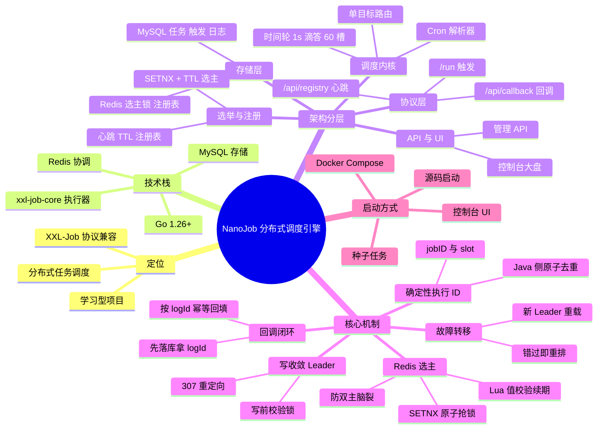

# NanoJob

基于 **Go + MySQL + Redis** 的分布式任务调度引擎（学习型项目），核心接口兼容 **XXL-Job** 执行器触发协议。

<p align="center">
  
  
  
  
</p>

## 简介

NanoJob 用 Go 从零实现了分布式任务调度的核心链路，砍掉了边缘功能，保留时间轮 + XXL-JOB 适配器这两个差异化卖点：

| 层 | 实现 | 说明 |
| :--- | :--- | :--- |
| 存储 | MySQL | 任务配置、触发时间、执行日志（`nanojob_job` / `nanojob_log` 两张表） |
| 选主与注册表 | Redis | 选主用 SETNX + TTL 自研锁；执行器心跳 `SET key EX 90` 过期自动摘除 |
| 调度内核 | 单层内存时间轮 + 圈数计数 | 1s 滴答 × 60 槽，**仅 Leader 运行** |
| 触发协议 | XXL-Job HTTP 协议 | `/run` 触发、`/api/callback` 结果回调、`/api/registry` 心跳 |
| 任务 ID | MySQL 自增 | 天然全局唯一，替代雪花 + WorkerID 池 |

> 定位：学习分布式调度、Redis 选主、写收敛与容错设计。存储层（MySQL/Redis）暂为单实例，应用层多副本 HA。

## 项目思维导图



## 架构

```
            前端 UI (ui/index.html, 任意节点地址)
                    │ 写请求
                    ▼
        ┌───────────────────────────────┐
        │  Go 引擎集群 (应用层多副本)      │
        │  Leader: 时间轮调度 + 写路径    │
        │  Standby: 只收 HTTP, 写请求     │
        │          307 重定向到 Leader    │
        └──────┬───────────────┬─────────┘
               │               │
       ┌───────▼─────┐   ┌─────▼──────────┐
       │ MySQL       │   │ Redis          │
       │ 任务+触发+日志│   │ 选主锁 + 注册表 │
       └─────────────┘   └────────────────┘
               ▲
               │ /run 触发 + executionId 幂等
               │ 跑完 POST /api/callback 回填结果
        ┌──────┴──────────┐
        │ Java 执行器集群   │
        │ (xxl-job-core)  │
        └─────────────────┘
```

### 核心机制

**1. Redis 选主（SETNX + TTL 自研锁，5s 租约）**

`SET nanojob:election:<cluster> <nodeID> NX EX 5` 一步原子抢锁；Leader 每 tick（ttl/3）用 Lua 脚本**按值校验**后刷新 TTL —— 只有 key 当前值仍是自己才续期，杜绝"旧主失联后与新主同时续期一把锁 = 双主脑裂"（汲取 easytask `distribmu` 的 LockWait 超时误判教训）。锁持有值就是 Leader 的对外地址，同时充当 Standby 的重定向目标。

**2. 写收敛 Leader（砍掉 etcd Watch 与三层去重）**

写请求打到任何节点都行：Leader 直接落库并挂时间轮；Standby 收到写 → **307 重定向**到当前 Leader（`fetch` 自动跟随，Body 原样带过去）。Leader 真正写入前再调 `VerifyLeadership()` 问一次 Redis，防"检查通过到写入之间锁被抢走"。调度权与"谁收到请求"再次解耦，但这次靠的是写收敛而不是 Watch 回环，所以 `inWheel/lastFired/skipDedup` 三层去重可以整体删除。

**3. 回调闭环（`/api/callback` + `nanojob_log`）**

```
触发前先插一行"运行中"日志拿 logId
   → RunReq 带 LogID / LogDateTime 发给 Java
   → Java 跑完 xxl-job-core 自动 POST /api/callback
   → 按 logId 幂等回填 handleCode(200成功/500失败) + handleMsg(日志内容)
```

回调端点**所有节点**都注册、不必收敛 Leader —— 日志追加到共享 MySQL、按自增 logId 定位。执行器配 `xxl.job.admin.addresses` 指向任意一台 Go 引擎即可，标准 xxl-job-core 无需改动。字段名是 `logDateTim`（不是 logDateTime），解析时别按错。

**4. 确定性执行 ID + 执行器幂等（at-least-once 兜底）**

每次触发生成 `execID = jobID:slot`，经 `executorParams` 透传给 Java；执行器按此 ID 原子占位去重，新旧 Leader 交接期重复派发直接跳过。`execID` 必须确定性派生（不能用随机 UUID），`slot` 必须在异步派发前快照。

**5. 故障转移**

新 Leader 当选后从 MySQL 全量加载任务挂进时间轮。错过的一次触发（原触发点已在过去）**直接跳过、从当前时刻重排**，行为可预期，不再补偿。

## 启动方法

### 准备

- Go 1.26+
- MySQL 8+ 与 Redis（单实例即可）

### 环境变量（可选，多引擎差异化时用）

配置以 `conf.json` 为基准，以下环境变量可**覆盖**关键字段（docker-compose 三引擎就是靠它让每台引擎互不相同）：

| 环境变量 | 覆盖的配置字段 | 说明 |
| :--- | :--- | :--- |
| `NANOJOB_DSN` | `mysql.dsn` | MySQL 连接串（连哪台库） |
| `NANOJOB_REDIS_ADDR` | `redis.addr` | Redis 地址（选主锁 + 注册表共用） |
| `NANOJOB_ADVERTISE_ADDR` | `api_server.http.advertise_addr` | 本节点对外地址 = 选主锁持有值 + 重定向目标，**多引擎必须各不相同** |

### 方式一：Docker Compose（MySQL + Redis + 3 引擎）

```bash
docker-compose up -d
```

一条命令拉起：MySQL（3306）、Redis（6379）、三个 Go 引擎（8081/8082/8083）。停止中间某一台引擎，另两台会自动重新选主接管——可直接观察故障转移日志。

**注意**：引擎之间用容器服务名互通（如 `nanojob1:8080`）。浏览器访问 `localhost:8081~8083` 时，若写请求落在 Standby，重定向 Location 是容器内地址、浏览器解析不了 —— 想从浏览器验证"重定向"效果，把对应引擎的 `NANOJOB_ADVERTISE_ADDR` 改成 `http://localhost:<映射端口>` 即可。

### 方式二：源码启动

```bash
# 单引擎（库和表都不用手动建 —— 引擎启动时自举建库 + 建表）
go run ./cmd/nanojob/main.go -c conf.json

# 三引擎本地演示：各开一个终端，改端口 + advertise_addr
NANOJOB_ADVERTISE_ADDR=http://127.0.0.1:9090 go run ./cmd/nanojob/main.go -c conf.json
NANOJOB_ADVERTISE_ADDR=http://127.0.0.1:9091 go run ./cmd/nanojob/main.go -c conf.json
```

引擎启动时自动做两件事：① 若 `nanojob` 库不存在则创建（库名取自 `mysql.dsn`）；② 确保 `nanojob_job` / `nanojob_log` 两表存在（`CREATE TABLE IF NOT EXISTS`，幂等）。建库建表 SQL 以独立 `.sql` 文件管理在 `core/store/sql/` 下，随二进制 `go:embed` 嵌入。

### 注入种子任务

```bash
go run ./cmd/seed/main.go    # 向 MySQL 插入一条每 10 秒触发的演示任务
```

### 可视化大盘

引擎不托管静态页面。双击打开 `ui/index.html`（通过 `http://localhost:8080/api` + CORS 读写），可新增任务、查看每行任务的**下次触发时间**与**执行日志**。

### 验证核心链路（curl）

```bash
# ① 模拟执行器心跳 → 注册进 Redis（TTL 90s 自动摘除）
curl -X POST http://127.0.0.1:8080/api/registry \
  -d '{"registryGroup":"EXECUTOR","registryKey":"loan-service","registryValue":"192.168.1.100:9999"}'

# ② 新增任务（写请求收敛到 Leader，落地后返回自增 id）
curl -X POST http://127.0.0.1:8080/api/job/add \
  -H 'Content-Type: application/json' \
  -d '{"cron":"0/10 * * * * ?","executorHandler":"loanInterestJobHandler","appName":"loan-service"}'

# ③ 查任务列表（含下次触发时间）
curl http://127.0.0.1:8080/api/job/list

# ④ 模拟 Java 跑完回调 → 回填该次执行日志结果（logId 从日志列表里取）
curl -X POST http://127.0.0.1:8080/api/callback \
  -d '[{"logId":1,"logDateTim":1700000000000,"handleCode":200,"handleMsg":"ok"}]'

# ⑤ 查执行日志（handleCode：0=运行中 / 200=成功 / 500=失败）
curl 'http://127.0.0.1:8080/api/job/logs?id=1'
```

### Java 执行器接入

实现的是 XXL-Job 执行器协议核心子集，基于 xxl-job-core 的客户端可以直接接入：

```yaml
xxl:
  job:
    admin:
      addresses: http://<nanojob-engine-ip>:8080   # 回调 + 心跳都打这里
    executor:
      appname: loan-service
```

示例执行器在 `examples/java-executor`（Spring Boot + xxl-job-core，含 ExecutionDedup 幂等 demo），需向引擎 `/registry` 上报心跳。

### 常见问题

| 症状 | 排查方向 |
| :--- | :--- |
| 启动报 `连接 MySQL 失败` | MySQL 未启动，或 `conf.json` 的 `mysql.dsn` 账号/密码/端口不对 |
| 启动报 `无法连接 Redis` | Redis 未启动，或 `redis.addr` 不对 |
| 一直选不出主 | Redis 没起，或多引擎 `advertise_addr` 相同导致锁值冲突 |
| 任务不派发、日志停在"运行中" | 该 AppName 下没有活着的执行器（没心跳进 `/api/registry`） |
| 浏览器新增任务失败 | 写请求落到 Standby 且重定向地址不可达（容器服务名，见方式一注意） |
| `8080` 端口被占 | 改 `conf.json` 的 `port`，并同步改 `advertise_addr` 里的端口 |

## 目录结构

```
cmd/nanojob/              引擎入口 (config 加载、Redis 选主、API 装配)
cmd/seed/                 MySQL 种子任务注入
core/timewheel/           单层时间轮 (tick + 圈数计数)
core/store/               MySQL 持久化 (任务 + 日志; sql/ 独立管理建库建表 DDL, go:embed 嵌入)
core/registry/            执行器心跳注册 (Redis TTL, 90s 自动摘除)
core/election/            Redis SETNX+TTL 自研选主 (Lua 值校验续期)
core/scheduler/           调度核心 (挂轮子、派发、落日志、回调驱动)
core/router/              单目标路由 (轮询)
core/parser/              Spring 6 位 Cron 解析 (robfig/cron)
adapter/xxljob/           XXL-Job 触发协议封装 (/run)
api/                      管理 API + /api/callback + /api/registry
pkg/config/               JSON 配置加载 (支持环境变量覆盖)
examples/java-executor/   示例 Java 执行器 (含 ExecutionDedup 幂等 demo)
ui/                       可视化大盘 (直接打开 index.html 使用)
conf.json                 默认配置
```

## 与旧版（etcd）架构的差异

| 维度 | 旧版 (etcd) | 新版 (MySQL + Redis) |
| :--- | :--- | :--- |
| 存储 | etcd：任务 + 触发时间 | MySQL：任务 + 触发时间 + **执行日志** |
| 选主 | etcd concurrency Election | Redis SETNX + TTL 自研锁（Lua 值校验续期） |
| 增量消费 | Watch 统一消费 + read-then-watch | **写收敛 Leader**（Standby 307 重定向 + 写前校验锁） |
| 去重 | 三层去重（inWheel/lastFired/skipDedup） | 删掉（撤 Watch 后回环消失） |
| 补偿 | misfire 补偿（>5s 补一次） | 砍掉（错过即跳过，从当前重排） |
| 路由 | 分片广播 SHARDING | 砍掉，单目标轮询 |
| 任务 ID | 雪花 + WorkerID 池（etcd 租约） | MySQL 自增 |
| 执行结果 | fire-and-forget，无感知 | **/api/callback 闭环 + 日志落库** |
| 部署 | docker-compose(etcd) + K8s 清单 | docker-compose(MySQL+Redis+3 引擎)，K8s 砍掉 |

## 已知限制

- **接口无鉴权**：`/api/*`、`/api/callback`、`/api/registry` 未做认证。
- **存储层单点**：MySQL / Redis 暂单实例；应用层多副本 HA，存储层故障无自动恢复。
- **触发粒度约 1s**：引擎时间轮 1s 滴答。
- **写收敛靠重定向**：Standby 收到写请求依赖浏览器/客户端跟随 307；容器内服务名对浏览器不可达（见上文 Compose 注意）。
- **Java 去重仅进程内**：demo 用内存表去重，多实例需换共享存储（MySQL 唯一索引 / Redis SETNX）。
- **无任务删除接口**：store 层有 `DeleteJob`，但未暴露 HTTP 路由。
- **未做集群压测**：单 MySQL / 单 Redis 假设下验证过选举与调度，大规模横向扩展未压测。
