# NanoJob

基于 **Go + MySQL + Redis** 的分布式任务调度引擎（学习型项目），核心接口兼容 **XXL-Job** 执行器触发协议。

<p align="center">
  
  
  
  
</p>

<p align="center">
  🎬 视频讲解：<a href="https://b23.tv/teLCude">【个人项目-go语言调度中心】</a>
</p>

## 简介

NanoJob 用 Go 从零实现了分布式任务调度的核心链路，砍掉了边缘功能，保留时间轮 + XXL-JOB 适配器这两个差异化卖点：

| 层 | 实现 | 说明 |
| :--- | :--- | :--- |
| 存储 | MySQL | 任务配置、触发时间、执行日志（`nanojob_job` / `nanojob_log` 两张表） |
| 选主与注册表 | Redis | 选主用 SETNX + TTL 自研锁；执行器心跳 `SET key EX 90` 过期自动摘除 |
| 调度内核 | 单层内存时间轮 + 圈数计数 | 1s 滴答 × 60 槽，**仅 Leader 运行** |
| 触发协议 | XXL-Job HTTP 协议 | `/run` 触发、`/api/callback` 结果回调、`/api/registry` 心跳 |
| 任务 ID | MySQL 自增 | 天然全局唯一，替代雪花 + WorkerID 池 |

> 定位：学习分布式调度、Redis 选主、写收敛与容错设计。存储层（MySQL/Redis）暂为单实例，应用层多副本 HA。

## 项目思维导图

```mermaid
flowchart TD
    root((NanoJob 分布式调度引擎))

    root --> loc
    loc["定位"] --> loc1["分布式任务调度"]
    loc --> loc2["XXL-Job 协议兼容"]
    loc --> loc3["学习型项目"]

    root --> tech
    tech["技术栈"] --> tech1["Go 1.26+"]
    tech --> tech2["MySQL 存储"]
    tech --> tech3["Redis 协调"]
    tech --> tech4["xxl-job-core 执行器"]

    root --> layer
    layer["架构分层"] --> l1["存储层"]
    l1 --> l1a["MySQL：任务 / 触发 / 日志"]
    l1 --> l1b["Redis：选主锁 / 注册表"]
    layer --> l2["调度内核"]
    l2 --> l2a["时间轮 1s 滴答 × 60 槽"]
    l2 --> l2b["Cron 解析器"]
    l2 --> l2c["单目标路由"]
    layer --> l3["选举与注册"]
    l3 --> l3a["SETNX + TTL 选主"]
    l3 --> l3b["心跳 TTL 注册表"]
    layer --> l4["协议层"]
    l4 --> l4a["/run 触发"]
    l4 --> l4b["/api/callback 回调"]
    l4 --> l4c["/api/registry 心跳"]
    layer --> l5["API 与 UI"]
    l5 --> l5a["管理 API"]
    l5 --> l5b["控制台大盘"]

    root --> core
    core["核心机制"] --> c1["Redis 选主"]
    c1 --> c1a["SETNX 原子抢锁"]
    c1 --> c1b["Lua 值校验续期"]
    c1 --> c1c["防双主脑裂"]
    core --> c2["写收敛 Leader"]
    c2 --> c2a["307 重定向"]
    c2 --> c2b["写前校验锁"]
    core --> c3["回调闭环"]
    c3 --> c3a["先落库拿 logId"]
    c3 --> c3b["按 logId 幂等回填"]
    core --> c4["确定性执行 ID"]
    c4 --> c4a["jobID 与 slot"]
    c4 --> c4b["执行日志关联"]
    core --> c5["故障转移"]
    c5 --> c5a["新 Leader 重载"]
    c5 --> c5b["错过即重排"]

    root --> start
    start["启动方式"] --> st1["Docker Compose"]
    start --> st2["源码启动"]
    start --> st3["种子任务"]
    start --> st4["控制台 UI"]
```



## 架构

```
            前端 UI (ui/index.html, 任意节点地址)
                    │ 写请求
                    ▼
        ┌───────────────────────────────┐
        │  Go 引擎集群 (应用层多副本)      │
        │  Leader: 时间轮调度 + 写路径    │
        │  Standby: 只收 HTTP, 写请求     │
        │          307 重定向到 Leader    │
        └──────┬───────────────┬─────────┘
               │               │
       ┌───────▼─────┐   ┌─────▼──────────┐
       │ MySQL       │   │ Redis          │
       │ 任务+触发+日志│   │ 选主锁 + 注册表 │
       └─────────────┘   └────────────────┘
               ▲
               │ /run 触发 + executionId 幂等
               │ 跑完 POST /api/callback 回填结果
        ┌──────┴──────────┐
        │ Java 执行器集群   │
        │ (xxl-job-core)  │
        └─────────────────┘
```

## 启动方法

### 准备

- Go 1.26+
- MySQL 8+ 与 Redis（单实例即可）

### 环境变量（可选，多引擎差异化时用）

配置以 `conf.json` 为基准，以下环境变量可**覆盖**关键字段（docker-compose 三引擎就是靠它让每台引擎互不相同）：

| 环境变量 | 覆盖的配置字段 | 说明 |
| :--- | :--- | :--- |
| `NANOJOB_DSN` | `mysql.dsn` | MySQL 连接串（连哪台库） |
| `NANOJOB_REDIS_ADDR` | `redis.addr` | Redis 地址（选主锁 + 注册表共用） |
| `NANOJOB_ADVERTISE_ADDR` | `api_server.http.advertise_addr` | 本节点对外地址 = 选主锁持有值 + 重定向目标，**多引擎必须各不相同** |

### 方式一：Docker Compose（MySQL + Redis + 3 引擎）

```bash
docker-compose up -d
```

一条命令拉起：MySQL（3306）、Redis（6379）、三个 Go 引擎（宿主映射 `8401/8402/8403`，对应应用内 8080）。停止中间某一台引擎，另两台会自动重新选主接管——可直接观察故障转移日志。**注意**：宿主端口统一用 `84xx` 是因为 `8081~8083` 会撞上 Windows 系统预留端口段（如 Hyper-V/winnat 排除的 `7991-8090`），本机若遇到 `bind: ... access permissions` 报错，先 `netsh int ipv4 show excludedportrange protocol=tcp` 查排除段，再把映射端口挑到段外即可。

**注意**：引擎之间用容器服务名互通（如 `nanojob1:8080`）。浏览器访问 `localhost:8401/8402/8403` 时，若写请求落在 Standby，重定向 Location 是容器内地址、浏览器解析不了 —— 想从浏览器验证"重定向"效果，把对应引擎的 `NANOJOB_ADVERTISE_ADDR` 改成 `http://localhost:<映射端口>` 即可。

### 方式二：源码启动

```bash
# 单引擎（库和表都不用手动建 —— 引擎启动时自举建库 + 建表）
go run ./cmd/nanojob/main.go -c conf.json

# 三引擎本地演示：各开一个终端，改端口 + advertise_addr
NANOJOB_ADVERTISE_ADDR=http://127.0.0.1:9090 go run ./cmd/nanojob/main.go -c conf.json
NANOJOB_ADVERTISE_ADDR=http://127.0.0.1:9091 go run ./cmd/nanojob/main.go -c conf.json
```

引擎启动时自动做两件事：① 若 `nanojob` 库不存在则创建（库名取自 `mysql.dsn`）；② 确保 `nanojob_job` / `nanojob_log` 两表存在（`CREATE TABLE IF NOT EXISTS`，幂等）。建库建表 SQL 以独立 `.sql` 文件管理在 `core/store/sql/` 下，随二进制 `go:embed` 嵌入。

### 注入种子任务

```bash
go run ./cmd/seed/main.go    # 向 MySQL 插入一条每 10 秒触发的演示任务
```

### 可视化大盘

引擎不托管静态页面。双击打开 `ui/index.html`（通过 API + CORS 读写），可新增任务、查看每行任务的**下次触发时间**与**执行日志**。

前端在 `ui/index.html` 顶部 `API_ENGINES` 数组里配置**全部引擎地址**，请求按顺序尝试：当前引擎挂了自动切下一台（**失败重试，非随机**），写请求落在 Standby 时引擎 307 重定向到 Leader、`fetch` 自动跟随。头部状态栏会实时显示当前连的是哪台引擎——杀掉一台引擎再刷新页面，就能看到故障转移。

## 背景与解决的问题：相对 Java XXL-Job

NanoJob 不是又一个 XXL-Job，而是针对 Java 版 XXL-Job 的几个痛点，用 Go 从零重写的调度引擎。它**兼容 XXL-Job 的执行器协议，但换掉了调度中心的实现方式**。下表是相对 XXL-Job 的差异 && NanoJob 各自的解法：

| 对比点 | Java XXL-Job | NanoJob 相对它解决的问题 |
| :--- | :--- | :--- |
| **调度驱动方式** | 调度中心是 Spring Boot 应用，调度线程持续**轮询扫数据库**拉取到点任务，调度热路径依赖 DB | 用**内存时间轮（1s 滴答 × 60 槽）**驱动触发，运行期调度零 DB 轮询压力；MySQL 只存任务/触发点/日志，作为故障恢复的「记忆」 |
| **部署形态** | 依赖 JVM + Spring Boot 全家桶，体积与启动成本高 | Go 编译为**单个静态二进制**，无外部运行时，启停快、资源占用低，适合容器/边缘场景 |
| **调度层高可用** | 调度中心本身**单点**，HA 需另行部署调度中心集群 | 调度引擎**天然多副本**，Redis `SETNX`+TTL 自选举出唯一 Leader，宕机自动接管，主备高可用是内建能力 |
| **防双主脑裂** | - | 抢锁一步原子完成；**续期用 Lua 值校验**（锁值仍是自己才续），续期失败/Redis 不可达即**让位停轮**，逻辑上与 etcd 同类 bug 隔离，杜绝双主同时派发 → 保证「恰好执行一次」 |
| **写收敛** | 写请求直接打调度中心 | Standby 受理写请求后 **307 重定向到 Leader**，配置/触发写操作收敛单点，不并发冲突 |
| **执行器迁移成本** | 下游是 Java 执行器 | `/run`、`/api/callback`、`/api/registry` **与 XXL-Job 协议兼容**，可直接复用现成的 `xxl-job-core` 执行器——**只替换调度中心侧，执行端零迁移** |

### 刻意的取舍（相对 XXL-Job 的非目标）

NanoJob 是学习型项目，砍掉了 XXL-Job 的边缘功能，换取内核可读与行为可预期：

- **砍掉 misfire 补偿**：错过的触发不补齐，从当前时刻重排，行为可预期；
- **砍掉失败重试、分片广播等策略**：路由只用简单的单目标 `PickOne`；
- **存储层（MySQL/Redis）暂为单实例**：HA 只覆盖应用层调度引擎，存储层 HA 是后续演进方向。

一句话概括：**NanoJob 用最精简的组件（Go + MySQL + Redis）回答分布式定时调度「如何高可用且恰好执行一次」，以 XXL-Job 协议做兼容层、以内存时间轮 + Redis 选主做内核，换取比 Java 版更轻的部署与自包含的高可用。**