# NanoJob

A distributed job scheduling engine written in **Go**, backed by **MySQL + Redis**, with core protocol compatibility with **XXL-Job** executors.

<p align="center">
  
  
  
  
</p>

> **Status: learning project.** Built to study distributed scheduling, Redis leader election, write convergence, and fault tolerance. Storage (MySQL/Redis) is single-instance; app-layer engines are HA replicas.

## Overview

| Layer | Implementation | Notes |
| :--- | :--- | :--- |
| Storage | MySQL | Job config, next-fire-time, execution logs (`nanojob_job` / `nanojob_log`) |
| Election & registry | Redis | SETNX + TTL custom lock for leader election; executor heartbeat `SET key EX 90` auto-eviction |
| Scheduling core | Single-level in-memory time wheel + circle counting | 1s tick × 60 slots, runs **on the Leader only** |
| Trigger protocol | XXL-Job HTTP subset | `/run` trigger, `/api/callback` result callback, `/api/registry` heartbeat |
| Job ID | MySQL auto-increment | Globally unique by construction (replaces Snowflake + WorkerID pool) |

## Project mind map

```mermaid
flowchart TD
    root((NanoJob scheduling engine))

    root --> loc
    loc["What it is"] --> loc1["Distributed job scheduling"]
    loc --> loc2["XXL-Job protocol compatible"]
    loc --> loc3["Learning project"]

    root --> tech
    tech["Tech stack"] --> tech1["Go 1.26+"]
    tech --> tech2["MySQL storage"]
    tech --> tech3["Redis coordination"]
    tech --> tech4["xxl-job-core executors"]

    root --> layer
    layer["Architecture"] --> l1["Storage layer"]
    l1 --> l1a["MySQL: jobs / triggers / logs"]
    l1 --> l1b["Redis: election lock + registry"]
    layer --> l2["Scheduling core"]
    l2 --> l2a["1s tick × 60 slots"]
    l2 --> l2b["Cron parser"]
    l2 --> l2c["Single-target router"]
    layer --> l3["Election and registry"]
    l3 --> l3a["SETNX + TTL election"]
    l3 --> l3b["Heartbeat TTL registry"]
    layer --> l4["Protocol layer"]
    l4 --> l4a["/run trigger"]
    l4 --> l4b["/api/callback callback"]
    l4 --> l4c["/api/registry heartbeat"]
    layer --> l5["API and UI"]
    l5 --> l5a["Admin API"]
    l5 --> l5b["Dashboard"]

    root --> core
    core["Core mechanisms"] --> c1["Redis leader election"]
    c1 --> c1a["Atomic SETNX lock"]
    c1 --> c1b["Lua value-check renewal"]
    c1 --> c1c["No split-brain"]
    core --> c2["Write convergence"]
    c2 --> c2a["307 redirect"]
    c2 --> c2b["VerifyLeadership before write"]
    core --> c3["Callback loop"]
    c3 --> c3a["Insert log first, get logId"]
    c3 --> c3b["Idempotent backfill by logId"]
    core --> c4["Deterministic exec ID"]
    c4 --> c4a["jobID and slot"]
    c4 --> c4b["Execution log correlation"]
    core --> c5["Failover"]
    c5 --> c5a["New leader reloads"]
    c5 --> c5b["Skip missed, reschedule now"]

    root --> start
    start["How to start"] --> st1["Docker Compose"]
    start --> st2["Run from source"]
    start --> st3["Seed job"]
    start --> st4["Dashboard UI"]
```



## Architecture

```
              Frontend (ui/index.html, any engine address)
                       │ writes
                       ▼
        ┌───────────────────────────────┐
        │  Go engine cluster (HA)       │
        │  Leader: time wheel + writes  │
        │  Standby: 307-redirect writes │
        │          to the Leader        │
        └──────┬───────────────┬─────────┘
               │               │
       ┌───────▼─────┐   ┌─────▼──────────┐
       │ MySQL       │   │ Redis          │
       │ jobs+logs   │   │ lock+registry  │
       └─────────────┘   └────────────────┘
               ▲
               │ /run trigger + executionId idempotency
               │ POST /api/callback with the result
        ┌──────┴──────────┐
        │ Java executors  │
        │ (xxl-job-core)  │
        └─────────────────┘
```

## Startup

### Prerequisites

- Go 1.26+
- MySQL 8+ and Redis (single instance is enough)

### Environment variables (optional, needed for multi-engine setups)

Config is driven by `conf.json`; these variables **override** key fields (docker-compose gives each engine a distinct identity this way):

| Env var | Overrides | Notes |
| :--- | :--- | :--- |
| `NANOJOB_DSN` | `mysql.dsn` | MySQL DSN (which database to connect to) |
| `NANOJOB_REDIS_ADDR` | `redis.addr` | Redis address (shared by election lock + registry) |
| `NANOJOB_ADVERTISE_ADDR` | `api_server.http.advertise_addr` | This node's public address = election-lock value + redirect target; **must differ across engines** |

### Option A: Docker Compose (MySQL + Redis + 3 engines)

```bash
docker-compose up -d
```

Brings up MySQL (3306), Redis (6379), and three Go engines (8081/8082/8083). Stop any engine and the others re-elect a Leader — watch the failover logs.

> Engines talk to each other via container service names (`nanojob1:8080`). To exercise the browser redirect, set `NANOJOB_ADVERTISE_ADDR` to a `localhost:<mapped-port>` address.

### Option B: Run from source

```bash
# Single engine (database and tables are created automatically)
go run ./cmd/nanojob/main.go -c conf.json

# Three engines locally: one terminal each, vary the port + advertise_addr
NANOJOB_ADVERTISE_ADDR=http://127.0.0.1:9090 go run ./cmd/nanojob/main.go -c conf.json
NANOJOB_ADVERTISE_ADDR=http://127.0.0.1:9091 go run ./cmd/nanojob/main.go -c conf.json
```

On startup the engine (1) creates the `nanojob` database if missing (name taken from `mysql.dsn`), and (2) ensures the `nanojob_job` / `nanojob_log` tables exist (`CREATE TABLE IF NOT EXISTS`, idempotent). The DDL lives as standalone `.sql` files under `core/store/sql/`, embedded into the binary via `go:embed`.

### Seed a demo job

```bash
go run ./cmd/seed/main.go     # inserts a job that fires every 10 seconds
```

### Web dashboard

Open `ui/index.html` directly in a browser (talks to the engines over CORS). Shows each job's next-fire-time and execution logs.

The frontend lists **all engine addresses** in the `API_ENGINES` array at the top of `ui/index.html` and tries them in order: if the current engine dies it fails over to the next one automatically (ordered retry, not random). Writes landing on a Standby are 307-redirected to the Leader and `fetch` follows. The header status bar shows which engine is currently connected — kill an engine and refresh to watch the failover.